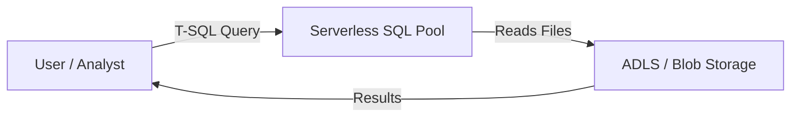

# Azure Synapse Analytics – Data Engineer Notes

## 📌 What is Azure Synapse Analytics?
- **Azure Synapse Analytics** = Microsoft’s **cloud data warehouse + analytics platform**.
- Combines **big data (data lakes)** with **data warehouse (SQL-based analytics)**.
- Provides a **single UI (Synapse Studio)** for:
  - Data ingestion (pipelines).
  - Data preparation (SQL & Spark).
  - Data storage (Dedicated SQL Pools, Lakehouse).
  - Data analytics (Power BI integration).

---

## 🏗️ Synapse Studio – Main Hubs
1. **Home** → Overview & quick start.
2. **Data** → Explore **Workspace databases** (SQL, Lakehouse) and **Linked external data**.
3. **Develop** → Write **SQL Scripts, Spark Notebooks, Data Flows, KQL Scripts**.
4. **Integrate** → Build **pipelines** (like ADF), linked services, triggers.
5. **Monitor** → Track pipelines, SQL queries, Spark jobs, integration runtimes.
6. **Manage** → Admin configuration (pools, runtimes, linked services, security).

---

## 🔹 Analytics Pools in Synapse
Synapse provides multiple compute engines:
- **SQL Pools**
  - **Dedicated SQL Pool** → Provisioned MPP data warehouse.
  - **Serverless SQL Pool** → On-demand, pay-per-query engine for data lake.
- **Apache Spark Pools** → Big data processing, transformations, ML (Delta format).
- **Data Explorer Pools (Preview)** → Real-time telemetry/log analytics (Kusto).

---

## 🔹 Dedicated vs Serverless SQL Pool (Architecture)


### **Serverless SQL Pool**
- Always available (no provisioning).
- Queries data **directly from ADLS/Blob**.
- Pay per TB scanned.



👉 Best for **ad-hoc queries, data exploration, Power BI quick reports**.

---

### **Dedicated SQL Pool**
- Requires provisioning compute (DWUs).
- Data must be **bulk loaded** into Synapse storage.
- Optimized with **MPP architecture** and columnstore indexes.

```mermaid
flowchart LR
    User[User / Analyst] -->|T-SQL Query| Dedicated[Dedicated SQL Pool (DWU/Mpp)]
    Dedicated --> Storage[Synapse Distributed Storage]
    ADLS[ADLS / Blob Storage] -->|Bulk Load / COPY INTO| Dedicated
    Dedicated -->|Results| User
```

👉 Best for **production BI dashboards, curated DW, heavy aggregations/joins**.

---

## 🔹 How Data is Stored in Dedicated SQL Pool
- Data is distributed across **60 distributions**.
- Distribution methods:
  1. **Hash** → For large fact tables (based on a key).
  2. **Round-robin** → Evenly, random distribution (good for staging).
  3. **Replicated** → Small tables copied to all distributions (good for dimensions).

---

## 🔹 Types of Databases in Synapse
1. **SQL Database**  
   - Backed by SQL Pools (Serverless/Dedicated).  
   - Used for structured analytics.  

2. **Lakehouse Database**  
   - Backed by Spark Pools (Delta format).  
   - Schema-on-read, ACID transactions via Delta Lake.  

3. **Kusto (Data Explorer) Database** (Preview)  
   - Backed by Data Explorer Pools.  
   - Best for telemetry, logs, time-series.  

---

## 🔹 Linked External Data (Data → Linked Tab)
- Synapse can connect to **90+ data sources** (same as ADF).  
- Categories:  
  - **Azure** → ADLS, Blob, Cosmos DB, Azure SQL, Synapse DW.  
  - **On-Prem** → SQL Server, Oracle, SAP, Teradata (via Self-hosted IR).  
  - **Other Clouds** → AWS S3, Redshift, GCP BigQuery, Snowflake.  
  - **SaaS** → Salesforce, Dynamics, ServiceNow, etc.  

👉 No hard limit on number of linked services.  

---

## 🔹 Cosmos DB + Synapse Link Scenario (Live Analytics)
- Example: **A live application writes operational data into Cosmos DB**.  
- Business users want **real-time analytics** on this data without impacting the app’s performance.  

### Challenge
- Cosmos DB **Transactional Store** is optimized for OLTP (fast reads/writes).  
- Running analytics directly:  
  - Slows down transactional workloads.  
  - Consumes expensive **RU/s**.  

### Solution → **Analytical Store**
- Cosmos DB provides an **Analytical Store**, which is a **columnar, analytics-optimized replica** of the Transactional Store.  
- This replica is kept **in sync automatically** (near real-time).  
- Queries for analytics run against the **Analytical Store**, not the Transactional Store.  

```mermaid
flowchart LR
    App[App / OLTP Writes] --> CosmosDB[(Cosmos DB Transactional Store)]
    CosmosDB -->|Synapse Link| Analytical[Cosmos DB Analytical Store (Replica)]
    Analytical --> SynapseServerless[Synapse Serverless SQL / Spark Pools]
    SynapseServerless --> PowerBI[Power BI Dashboard]
```

👉 **Benefit**: Business users get **near real-time analytics** without slowing down the production Cosmos DB.  

---

## 🔹 OPENROWSET Function in Synapse
- Allows **ad-hoc queries on files** in ADLS/Blob without loading into a table.  
- Supports **CSV, Parquet, JSON, Delta**.  
- Great for **exploration, prototyping, Power BI direct queries**.  

Example:
```sql
SELECT TOP 10 *
FROM OPENROWSET(
    BULK 'https://datalake.dfs.core.windows.net/raw/sales/*.parquet',
    FORMAT='PARQUET'
) AS rows;
```

👉 Best for **ad-hoc analysis**. For production, bulk load into Dedicated SQL Pool.  

---

## ✅ Key Takeaways
- **Serverless SQL Pool** = pay-per-query, query lake directly, best for exploration.  
- **Dedicated SQL Pool** = provisioned, optimized storage, best for BI dashboards.  
- **Spark Pools** = transformations, ML, Delta Lake.  
- **Data Explorer Pools** = logs, telemetry analytics.  
- **Cosmos DB Analytical Store** enables near real-time analytics.  
- **OPENROWSET** is the ad-hoc gateway to query files directly in ADLS.  
